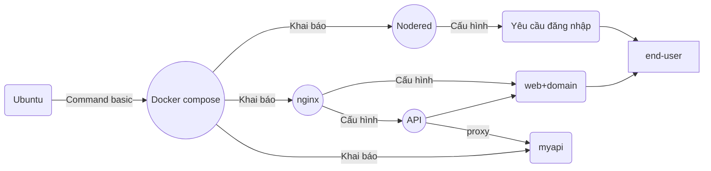
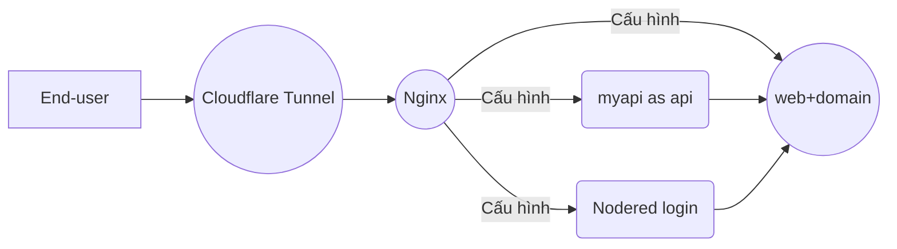

### G. Triển khai ứng dụng đến End-user
1. Trong Cloudflare: Tạo tunnel (đường hầm), chọn loại triển khai cho docker
2. Convert lệnh docker run ... sang dạng docker compose
3. Khai báo kết quả convert vào trong file docker-compose.yml
4. Chạy lại docker compose
5. Public ứng dụng bằng cách thêm 1 router trỏ tới container đang chạy trong docker, dữ liệu sẽ đi qua tunnel, url dạng sub-domain
6. Kiểm tra url sub-domain đã hoạt động public cho mọi end-user

#### Cấu trúc thư mục:
```
myapp/
├── docker-compose.yml
├── nginx/
│   └── nginx.conf
├── myweb/
│   └── index.html
└── nodered/ (sẽ tự sinh dữ liệu)
│   └── (có nhiều file tự sinh)
│   └── settings.js (file này cần edit để bắt nodered login)
```

#### Sơ đồ theo góc nhìn của dev:


#### Sơ đồ theo góc nhìn ngược lại:

### G. Câu hỏi về bài làm?
1. Tại sao phải dùng Nginx làm Reverse Proxy mà không trỏ thẳng Tunnel vào Node-RED?
2. Sự khác biệt giữa việc Mount file và Mount thư mục trong Docker là gì?
3. Nếu thay đổi file index.html ở máy Ubuntu, nội dung trên web có thay đổi ngay không? Tại sao?
4. docker-compose.yml khai báo các services có phần **restart: always** hoặc **restart: unless-stopped** : chúng để làm gì?
5. Cách khai báo để tất cả các services đều dùng chung 1 network? lợi ích của việc khai báo này là gì? Sửa đổi file docker-compose để tất cả các service đều dùng chung 1 network.
6. Tìm cách đưa Cloudflare **Token** vào trong file .env rồi sau đó thêm .env vào file .gitignore trước khi push code lên github. Tại sao nói đây là điều quan trọng về bảo mật mã nguồn?
7. Tại sao chúng ta nên thêm hậu tố :ro khi mount file cấu hình Nginx?
8. Khi dùng Cloudflare Tunnel: có cần thiết phải mở cổng cho các service nữa không?
# BÀI LÀM
### G. Triển khai ứng dụng đến End-user
1. Trong Cloudflare: Tạo tunnel (đường hầm), chọn loại triển khai cho docker
- Bước 1: vào Cloudflare
- Bước 2:mở Zero Trust
  > - Zero Trust → Networks → Tunnels
  
  - ấn Add a tunnel -> chọn cloudflared -> đặt tên cho tunnel -> Chọn môi trường chạy ( docker) -> lấy token và thêm vào docker-compose.yml 
  
- chạy lại docker

- 

-  Cấu hình router


# 2. Convert lệnh docker run ... sang dạng docker compose
- Sau khi convert, toàn bộ hệ thống có thể được khởi chạy chỉ bằng một lệnh duy nhất:
  > - docker compose up -d


# 3. Khai báo kết quả convert vào trong file docker-compose.yml
- Bước 1: Kiểm tra các container đang chạy
   > - docker ps
- Bước 2: Xác định lệnh docker run ban đầu
- Bước 3: Tạo file docker-compose.yml
- Bước 4: Chuyển đổi cấu hình vào docker-compose
- Bước 5: Khởi chạy hệ thống bằng Docker Compose
   > - docker compose up -d


#  4. Chạy lại docker compose
- docker compose up -d
 > - Ý nghĩa của lệnh
docker compose up: khởi động toàn bộ các service đã khai báo trong file docker-compose.yml
  -d: chạy ở chế độ nền (background), không chiếm terminal
Kiểm tra kết quả
Có thể kiểm tra trạng thái các container bằng: docker ps


# 5. Public ứng dụng bằng cách thêm 1 router trỏ tới container đang chạy trong docker, dữ liệu sẽ đi qua tunnel, url dạng sub-domain

- nginx reverse proxy (bên trong container)
web domain → nginx → /api → Flask API : routing nội bộ trong hệ thống

# 6. Kiểm tra url sub-domain đã hoạt động public cho mọi end-user
- [https://web.hoangthixuantrang.id.vn/]


- [ https://nodered.hoangthixuantrang.id.vn/]


[ api.hoangthixuantrang.id.vn/]


### G. Câu hỏi về bài làm

# 1. Tại sao phải dùng Nginx làm Reverse Proxy mà không trỏ thẳng Tunnel vào Node-RED?
- Nginx giúp đóng vai trò reverse proxy để điều hướng nhiều dịch vụ trên cùng một domain. Nếu trỏ Cloudflare Tunnel trực tiếp vào Node-RED thì chỉ sử dụng được một service duy nhất, khó mở rộng.
- Ngoài ra, Nginx giúp:
  > - Quản lý nhiều service (web, API, Node-RED) trên cùng một domain
  > - Tăng bảo mật bằng cách che giấu service nội bộ
  > - Dễ dàng cấu hình routing (/api, /web,...)

# 2. Sự khác biệt giữa việc Mount file và Mount thư mục trong Docker là gì?
- Sự khác biệt giữa Mount file và Mount thư mục trong Docker
  > - Mount file: chỉ ánh xạ một file cụ thể từ máy host vào container (ví dụ nginx.conf)
  > -Mount thư mục: ánh xạ toàn bộ thư mục từ host vào container

- Khác nhau:
  > - File mount: thay đổi 1 file → container dùng file đó
  > - Folder mount: thay đổi nhiều file → container cập nhật toàn bộ thư mục

# 3. Nếu thay đổi file index.html ở máy Ubuntu, nội dung trên web có thay đổi ngay không? Tại sao?
- Có, sẽ thay đổi ngay nếu file được mount vào container.
- Vì Docker sử dụng volume mapping:
  > - File trên host được ánh xạ trực tiếp vào container
  > - Khi host thay đổi → container đọc dữ liệu mới ngay lập tức

# 4. docker-compose.yml khai báo các services có phần **restart: always** hoặc **restart: unless-stopped** : chúng để làm gì?
- restart: always: container luôn tự khởi động lại khi bị crash hoặc khi Docker restart
- restart: unless-stopped: tự restart trừ khi người dùng chủ động dừng container
  => Giúp đảm bảo hệ thống luôn hoạt động ổn định

# 5. Cách khai báo để tất cả các services đều dùng chung 1 network? lợi ích của việc khai báo này là gì? Sửa đổi file docker-compose để tất cả các service đều dùng chung 1 network.
   - Khai báo:
     networks:
  mynetwork:

services:
  nginx:
    networks:
      - mynetwork

  myapi:
    networks:
      - mynetwork

  nodered:
    networks:
      - mynetwork
  - Lợi ích:
    > - Các container có thể giao tiếp bằng tên service
    > - Không cần expose port ra ngoài không cần thiết
    > - Tăng tính bảo mật và quản lý hệ thống tốt hơn
# 6. Tìm cách đưa Cloudflare **Token** vào trong file .env rồi sau đó thêm .env vào file .gitignore trước khi push code lên github. Tại sao nói đây là điều quan trọng về bảo mật mã nguồn?
- Token Cloudflare chứa quyền truy cập hệ thống.
- Nếu push lên GitHub:
  > - Người khác có thể chiếm quyền tunnel
  > - Dễ bị tấn công hoặc phá hệ thống

- Vì vậy:
  > - Đưa token vào .env
  > - Thêm .env vào .gitignore
→ đảm bảo bảo mật thông tin nhạy cảm

# 7. Tại sao chúng ta nên thêm hậu tố :ro khi mount file cấu hình Nginx?
- :ro = read-only (chỉ đọc)

 - Lợi ích:
  > - Container không thể sửa file cấu hình
  > - Tăng bảo mật
  > - Tránh lỗi do service ghi đè file config

# 8. Khi dùng Cloudflare Tunnel: có cần thiết phải mở cổng cho các service nữa không?
- Không cần thiết phải mở cổng public cho các service.
- Vì:
    > - Tunnel tạo kết nối outbound từ server → Cloudflare
    > - Cloudflare xử lý truy cập từ bên ngoài
- Lợi ích:
    > - Không cần mở firewall
    > - Tăng bảo mật hệ thống
    > - Giảm rủi ro bị scan port
