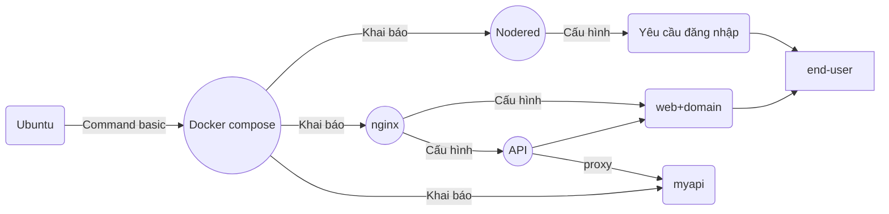
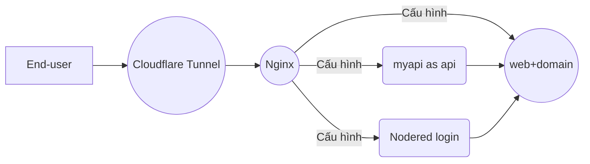

### G. Triển khai ứng dụng đến End-user
1. Trong Cloudflare: Tạo tunnel (đường hầm), chọn loại triển khai cho docker
2. Convert lệnh docker run ... sang dạng docker compose
3. Khai báo kết quả convert vào trong file docker-compose.yml
4. Chạy lại docker compose
5. Public ứng dụng bằng cách thêm 1 router trỏ tới container đang chạy trong docker, dữ liệu sẽ đi qua tunnel, url dạng sub-domain
6. Kiểm tra url sub-domain đã hoạt động public cho mọi end-user

#### Cấu trúc thư mục:
```
myapp/
├── docker-compose.yml
├── nginx/
│   └── nginx.conf
├── myweb/
│   └── index.html
└── nodered/ (sẽ tự sinh dữ liệu)
│   └── (có nhiều file tự sinh)
│   └── settings.js (file này cần edit để bắt nodered login)
```

#### Sơ đồ theo góc nhìn của dev:


#### Sơ đồ theo góc nhìn ngược lại:

# BÀI LÀM
1. Trong Cloudflare: Tạo tunnel (đường hầm), chọn loại triển khai cho docker
- Bước 1: vào Cloudflare
- Bước 2:mở Zero Trust
  > - Zero Trust → Networks → Tunnels
  
  - ấn Add a tunnel -> chọn cloudflared -> đặt tên cho tunnel -> Chọn môi trường chạy ( docker) -> lấy token và thêm vào docker-compose.yml 
  
- chạy lại docker

- 

-  Cấu hình router

